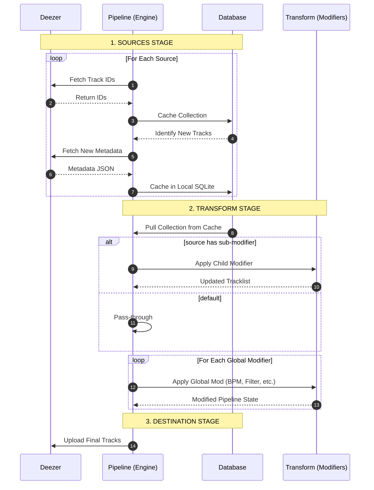

# Deezer Engine (Smart Playlists)

[](https://codeberg.org/kylemmkay/deezer-engine) 
[](https://hub.docker.com/r/kylemmkay/deezer-engine)

> [!NOTE]
> This repository was built with AI 🤖 assistance.

Deezer Engine is a Python-based pipeline system that allows you to create and maintain smart playlists using a declarative YAML configuration. Inspired by [Goofy](https://github.com/Chimildic/goofy).

> [!WARNING]
> **DATA LOSS RISK:** This script can delete songs from your playlists. Running this with an incorrect configuration may result in permanently lost playlists. It is under heavy revision; breaking changes are expected.

## 🚀 Quick Links

- **[Installation Guide](https://codeberg.org/kylemmkay/deezer-engine/wiki/Setup-Installation)** (Docker & Environment Variables)
- **[Strategy Configuration](https://codeberg.org/kylemmkay/deezer-engine/wiki/Strategy-Configuration)** (How to build your pipelines and examples)
- **[Full Documentation](https://codeberg.org/kylemmkay/deezer-engine/wiki)**

## 🛠️ How it Works

1. **Sources:** Pull tracks from your library, discovery mixes, or existing playlists.
2. **Transform:** Apply modifiers like `exclude`, `dedupe`, or `sort`.
3. **Destinations:** Sync the results back to a Deezer playlist automatically.

```log
░█▀▄░█▀▀░█▀▀░▀▀█░█▀▀░█▀▄░░░█▀▀░█▀█░█▀▀░▀█▀░█▀█░█▀▀
░█░█░█▀▀░█▀▀░▄▀░░█▀▀░█▀▄░░░█▀▀░█░█░█░█░░█░░█░█░█▀▀
░▀▀░░▀▀▀░▀▀▀░▀▀▀░▀▀▀░▀░▀░░░▀▀▀░▀░▀░▀▀▀░▀▀▀░▀░▀░▀▀▀

Running Deezer-Engine v0.8.1
This is free software under the GNU GPL v3.0.
For more details, see https://codeberg.org/kylemmkay/deezer-engine
2026-01-23 04:27:05 - [DeezerEngine] [INFO] - Authenticated successfully as: k...y
2026-01-23 04:27:05 - [DeezerEngine] [INFO] - >>> START 1/5: Processing Strategy: Taylor Swift: The Timeline
2026-01-23 04:27:05 - [DeezerEngine] [INFO] - Action: Sorting by release_date (ascending)
2026-01-23 04:27:16 - [DeezerEngine] [INFO] - Syncing 789 tracks to 'Taylor Swift: Complete Discography' (Full Replace)
2026-01-23 04:27:50 - [DeezerEngine] [INFO] - Sync complete for 'Taylor Swift: Complete Discography'.
2026-01-23 04:27:50 - [DeezerEngine] [INFO] - >>> START 2/5: Processing Strategy: High-Rank Discovery
2026-01-23 04:27:50 - [DeezerEngine] [INFO] - Action: Filtered 'rank > 500000': Kept 14/40 tracks.
2026-01-23 04:27:50 - [DeezerEngine] [INFO] - Action: Deduplicated 0 tracks
2026-01-23 04:27:50 - [DeezerEngine] [INFO] - Action: Shuffling with 'smart' shuffle.
2026-01-23 04:27:53 - [DeezerEngine] [INFO] - Syncing 172 tracks to 'High-Rank Discovery' (Full Replace)
2026-01-23 04:28:04 - [DeezerEngine] [INFO] - Sync complete for 'High-Rank Discovery'.
...
```

### Sequence Diagram 


## 🧑‍💻 Development

For building, running, and testing Deezer Engine as a developer, see the [Development Guide](https://codeberg.org/kylemmkay/deezer-engine/wiki/Development). This includes instructions for local Docker builds and details on developer templates for config and strategy validation.

## Acknowledgements

For all acknowledgements, see [the wiki page](https://codeberg.org/kylemmkay/deezer-engine/wiki/Acknowledgments)

## License
Licensed under **GNU GPLv3**. See [LICENSE](LICENSE) for details.
